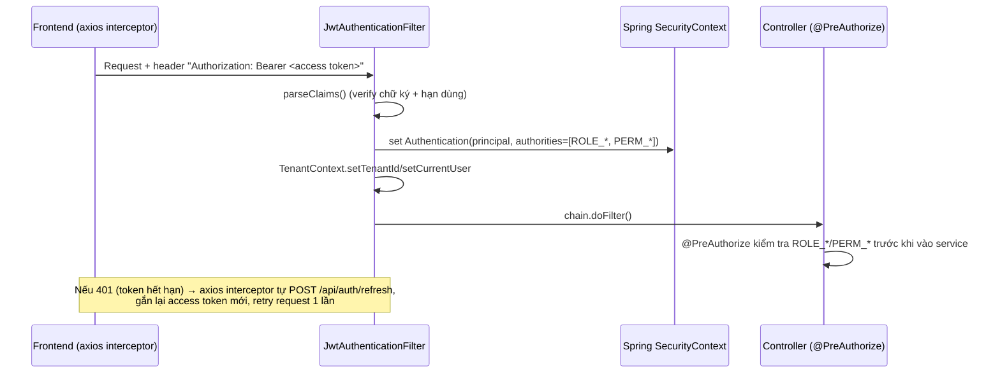
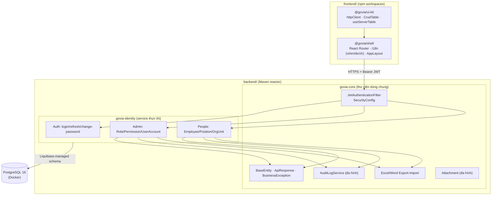

# Kiến trúc kỹ thuật

Tài liệu mô tả kiến trúc kỹ thuật hệ thống GOVIA — dựa trực tiếp trên code trong repo (`backend/`, `frontend/`, `.github/workflows/`), không suy diễn.

## 1. Tổng quan stack công nghệ

| Lớp | Công nghệ |
|---|---|
| Backend | Java 21, Spring Boot 3.3.4, Maven (multi-module reactor) |
| Bảo mật | Spring Security (stateless), JWT (jjwt 0.12.6), BCrypt |
| Dữ liệu | Spring Data JPA (Hibernate), Liquibase 4.29.2 (migration) |
| Database | PostgreSQL 16 (chính), hỗ trợ sẵn profile H2 (chạy thử không cần Docker) và Oracle |
| Xuất/Nhập file | Apache POI 5.3.0 (Excel/Word) |
| API docs | springdoc-openapi (Swagger UI tại `/swagger-ui.html`) |
| Frontend | React 18 + TypeScript, Vite, Ant Design 5, react-router-dom, react-i18next, axios |
| Quản lý mã nguồn frontend | npm workspaces (monorepo 1 app + 1 package dùng chung) |
| CI/CD | GitHub Actions (`.github/workflows/ci.yml`) |
| Container hoá | Docker Compose (chỉ Postgres — backend/frontend chạy trực tiếp, không container hoá) |

## 2. Kiến trúc Backend

### 2.1. Cấu trúc module Maven

```
govia-platform (pom, reactor gốc)
├── govia-core        → thư viện dùng chung, KHÔNG tự chạy được (không có main class)
└── govia-identity     → service Spring Boot thực thi (có main class, đang gánh cả 3 domain:
                          Identity/Access, People/HR, Admin)
```

`govia-identity` khai báo `scanBasePackages = "com.govia"` (không chỉ `com.govia.identity`) — nghĩa là mọi `@Component`/`@Service`/`@Entity` trong `govia-core` được nạp vào CÙNG 1 Spring context khi chạy, không cần khai báo riêng. Đây là mô hình **"module dùng chung + service hiện tại"**, chuẩn bị sẵn cho việc sau này tách thêm service khác (People, Audit, Risk...) cùng include `govia-core` mà không phải viết lại phần nền tảng.

### 2.2. `govia-core` cung cấp gì (dùng chung cho mọi service tương lai)

| Package | Chức năng |
|---|---|
| `web` | `ApiResponse<T>` (wrapper chuẩn mọi response), `BusinessException`, `GlobalExceptionHandler` |
| `security` | `JwtTokenProvider`, `JwtAuthenticationFilter`, `CurrentUserPrincipal`, `JwtProperties` |
| `tenant` | `TenantContext` (ThreadLocal), `AuditorAwareImpl` (nguồn cho `@CreatedBy`/`@LastModifiedBy`) |
| `entity` | `BaseEntity` — lớp cha bắt buộc cho MỌI entity trong platform |
| `audit` | `AuditLog`, `AuditLogService`, `AuditAction` — nhật ký thao tác đa hình (polymorphic), dùng chung cho mọi entity của mọi module |
| `export` | `ExcelExportService`/`ExcelImportService`/`WordExportService` — sinh/đọc file theo cấu hình cột khai báo bằng `ExportColumn`, không phải viết Apache POI tay ở từng module |
| `attachment` | `Attachment` (đính kèm file đa hình theo `entity_name`+`entity_id`), `LocalFileAttachmentServiceImpl` (lưu ổ đĩa cục bộ, cấu hình qua `GOVIA_ATTACHMENT_ROOT`) |

### 2.3. Cấu trúc 1 module nghiệp vụ (vd People, Admin trong `govia-identity`)

```
controller/   → @RestController, chỉ điều phối request/response + khai báo @PreAuthorize
service/      → toàn bộ business logic, validate, transaction (@Transactional)
repository/   → Spring Data JPA interface (không viết SQL tay, trừ khi cần Specification động)
entity/       → JPA entity, kế thừa BaseEntity
dto/          → record làm request/response, tách biệt hoàn toàn với entity (không lộ entity ra API)
```

Controller **không chứa business logic** — mọi validate/ràng buộc nằm ở service (xem 2 tài liệu nghiệp vụ: [Quản trị hệ thống](../quan-tri-he-thong/README.md), [Nhân sự](../nhan-su/README.md)).

### 2.4. `BaseEntity` — chuẩn dữ liệu bắt buộc cho mọi entity

```java
UUID id            // @GeneratedValue + @UuidGenerator
UUID tenantId       // không null, không update được sau khi tạo
Instant createdAt   // @CreatedDate (JPA Auditing)
String createdBy    // @CreatedBy — lấy từ AuditorAwareImpl → TenantContext
Instant updatedAt   // @LastModifiedDate
String updatedBy    // @LastModifiedBy
Long rowVersion     // @Version — optimistic locking, chặn 2 request ghi đè lẫn nhau
```

Mọi entity trong platform (kể cả module tương lai) kế thừa lớp này → đảm bảo **cùng 1 chuẩn dữ liệu** cho export/attachment/audit-log dùng chung (comment gốc trong code).

### 2.5. Quy ước xử lý lỗi

- Service throw `BusinessException(errorCode, message, httpStatus?)` — không throw `RuntimeException` trần.
- `GlobalExceptionHandler` (`@RestControllerAdvice`, quét toàn `com.govia`) bắt tập trung:
  - `BusinessException` → status tự khai báo (mặc định 400) + `{errorCode, message}`
  - `MethodArgumentNotValidException` (lỗi `@Valid`) → 400, gộp message tất cả field lỗi
  - `AccessDeniedException` → 403
  - `Exception` (fallback) → 500
- Mọi response, kể cả lỗi, đi qua `ApiResponse<T>` record: `{success, data, errorCode, message, timestamp}` — frontend chỉ cần 1 kiểu xử lý duy nhất (interceptor axios, xem mục 4).

## 3. Multi-tenancy

Không dùng schema-per-tenant hay database-per-tenant — dùng **1 schema chung, lọc theo cột `tenant_id`** trên mọi bảng nghiệp vụ. Cơ chế:

1. `JwtAuthenticationFilter` giải mã JWT ở đầu mỗi request, set `TenantContext.setTenantId(...)` (ThreadLocal).
2. Mọi service tự lấy `TenantContext.getTenantId()` khi query/tạo dữ liệu — **không có filter Hibernate tự động ở tầng ORM**, việc lọc tenant là trách nhiệm tường minh của từng service (mỗi hàm `getOwnedOrThrow`/`findByTenantId...` trong các service đều tự truyền `tenantId`).
3. `TenantContext.clear()` luôn được gọi trong khối `finally` của filter — tránh rò rỉ tenant giữa các request tái sử dụng cùng thread (thread pool của servlet container).

**Rủi ro cần lưu ý:** vì không có filter tự động, thêm 1 truy vấn mới ở service mà quên lọc `tenant_id` sẽ không bị chặn ở tầng nào khác — phụ thuộc hoàn toàn vào kỷ luật code theo đúng pattern `getOwnedOrThrow`/`findByTenantId...` đã có.

## 4. Xác thực & Phân quyền



- **Stateless hoàn toàn** — `SessionCreationPolicy.STATELESS`, không cookie session, không lưu trạng thái đăng nhập ở server.
- Access token nhúng sẵn `roles` + `permissions` (tính toán 1 lần lúc login, xem tài liệu Quản trị hệ thống mục 2.2) → mỗi request **không cần query DB để biết quyền**, chỉ giải mã JWT.
- 2 kiểu `@PreAuthorize` song song trong code:
  - `hasRole('SUPER_ADMIN')` — dùng cho các màn hình cấu hình lõi (Vai trò, Tài khoản, Quyền) không nằm trong permission catalog thông thường.
  - `hasAuthority('PERM_<MODULE>.<RESOURCE>.<ACTION>')` — dùng cho hầu hết API nghiệp vụ (People...), khớp trực tiếp với bảng `permission.code`.
- **Danh sách endpoint public** khai báo tường minh từng đường dẫn trong `SecurityConfig.PUBLIC_ENDPOINTS` (login, refresh, Swagger, health) — **cố ý không dùng wildcard** `/api/auth/**` để mọi endpoint MỚI thêm vào `AuthController` sau này (vd đổi mật khẩu) mặc định vẫn yêu cầu xác thực, tránh vô tình để lộ.
- CORS: danh sách origin cho phép cấu hình qua `govia.cors.allowed-origins` (mặc định `localhost:5173`/`localhost:3000` — 2 cổng dev server phổ biến của Vite/CRA).

## 5. Optimistic locking & Audit log

- **Optimistic locking**: mọi entity có `@Version rowVersion` — 2 request sửa đồng thời cùng 1 bản ghi, request thứ 2 nhận `ObjectOptimisticLockingFailureException` khi lưu (thay vì âm thầm ghi đè mất dữ liệu của request đầu). *(Lưu ý: hiện `GlobalExceptionHandler` chưa có handler riêng cho exception này, sẽ rơi vào nhánh 500 chung.)*
- **Audit log đa hình**: `AuditLogService.record(entityName, entityId, action, detail)` — 1 hàm dùng chung cho MỌI entity của MỌI module (không cần bảng audit riêng từng module). Ghi nhận ở cấp **thao tác nghiệp vụ có ý nghĩa** (tạo/sửa/xoá/publish...) do service tự gọi tường minh sau khi thành công — không phải interceptor tự động bắt mọi thay đổi ở tầng field.

## 6. Framework Xuất/Nhập file dùng chung

`ExcelExportService`/`WordExportService`/`ExcelImportService` (interface trong `govia-core`, implement bằng Apache POI) hoạt động theo cấu hình cột khai báo bằng `List<ExportColumn>` (key + nhãn hiển thị) — mọi module chỉ cần khai báo cột 1 lần và tái dùng CHÍNH XÁC cấu hình đó cho cả xuất lẫn nhập (đảm bảo file nhập lại đúng khớp file đã xuất, xem `roleExportColumns()`, `exportColumns()` ở các service nghiệp vụ). Nhập file luôn xử lý **theo từng dòng độc lập** — 1 dòng lỗi không làm hỏng toàn bộ file, kết quả trả về (`ImportResult`) gồm số dòng thành công + danh sách lỗi kèm số dòng cụ thể.

## 7. Đính kèm file (Attachment)

`Attachment` là bảng đa hình dùng chung (giống `AuditLog`): 1 file đính kèm gắn với `entity_name` + `entity_id` bất kỳ, không cần bảng attachment riêng cho từng module. Lưu trữ mặc định trên ổ đĩa cục bộ (`LocalFileAttachmentServiceImpl`, đường dẫn gốc cấu hình qua `GOVIA_ATTACHMENT_ROOT`, mặc định `./data/attachments`), giới hạn 25MB/file.

## 8. Kiến trúc Frontend

### 8.1. Monorepo npm workspaces

```
frontend/
├── apps/shell/           → @govia/shell — ứng dụng React thực chạy (Vite + React Router)
└── packages/govia-ui-kit/ → @govia/ui-kit — thư viện dùng chung, KHÔNG tự chạy
```

Cùng triết lý với backend (`govia-core` vs `govia-identity`): logic/component **dùng chung** tách riêng khỏi ứng dụng cụ thể, để sau này thêm app frontend khác (nếu có) tái dùng được ngay.

### 8.2. `@govia/ui-kit` cung cấp gì

| Export | Chức năng |
|---|---|
| `createGoviaHttpClient(baseURL)` | Axios instance dùng chung: tự gắn Bearer token vào mọi request, tự `POST /api/auth/refresh` và retry 1 lần khi gặp 401 (gộp nhiều request refresh đồng thời thành 1 promise dùng chung, tránh gọi refresh trùng lặp) |
| `getStoredTokens`/`storeTokens`/`clearTokens` | Quản lý token trong `localStorage` (key `govia.tokens`) |
| `CrudTable`, `useServerTable` | Bảng dữ liệu chuẩn hoá: phân trang/sắp xếp/lọc phía server theo 1 pattern duy nhất |
| `useSearchColumn`, `useSelectFilterColumn`, `useClientSearchColumn` | Helper dựng cột lọc Ant Design Table đồng nhất giữa các màn hình |
| `StandardToolbar` | Thanh công cụ chuẩn (thêm mới, xuất Excel/Word, nhập Excel) tái dùng cho mọi màn hình danh sách |
| `AttachmentPanel` | Khối UI đính kèm file dùng chung, khớp với API `Attachment` ở `govia-core` |
| `CodeWithTooltip` | Hiển thị mã kèm tooltip, dùng lặp lại nhiều màn hình |

Nhờ bộ chuẩn này, mỗi màn hình CRUD mới (Employee, Position, OrgUnit, Role, Account...) chỉ cần khai báo cột + gọi API riêng, không viết lại logic phân trang/lọc/xuất-nhập.

### 8.3. Routing & phân quyền UI

`App.tsx` định tuyến phẳng (không nest theo module) dưới 1 `ProtectedRoute` chung (chặn nếu chưa đăng nhập, dựa vào `AuthContext`). Menu sidebar (`AppLayout.tsx`) tự ẩn nhóm "Quản trị hệ thống" nếu `user.roles` không chứa `SUPER_ADMIN` — kiểm tra phía client để ẩn UI, **không thay thế** cho `@PreAuthorize` phía server (server luôn là nguồn chặn thật sự).

### 8.4. Đa ngôn ngữ (i18n)

`react-i18next`, 4 locale đầy đủ: `vi` (mặc định), `en`, `de`, `zh` — mỗi file JSON theo cùng 1 cấu trúc khoá (namespace theo module: `menu`, `employee`, `role`...), đổi ngôn ngữ qua `LanguageSwitcher` component dùng chung.

## 9. Migration & môi trường chạy

- **Liquibase**, changelog gốc `db/changelog/db.changelog-master.yaml` include tuần tự từng file `NNN-*.yaml` trong `changes/` — đánh số thứ tự, không sửa lại changeset đã chạy (chuẩn Liquibase: thêm changeset mới thay vì sửa cũ).
- 3 profile datasource khai báo sẵn trong `application.yml`, chọn qua `SPRING_PROFILES_ACTIVE`:

| Profile | Dùng khi | Cấu hình |
|---|---|---|
| `postgres` (mặc định) | Chạy thật, có Docker | `jdbc:postgresql://localhost:5432/govia`, user/pass `govia`/`govia` (đổi qua env `GOVIA_DB_*`) |
| `h2` | Chạy thử nhanh, không cần Docker | `jdbc:h2:mem:govia;MODE=PostgreSQL` — cùng chế độ tương thích cú pháp Postgres |
| `oracle` | Dự phòng, cần bỏ comment dependency `ojdbc11` trong `pom.xml` | `jdbc:oracle:thin:@localhost:1521/FREEPDB1` |

- Test (`mvn test`) **luôn chạy trên H2 in-memory** qua profile `test` (`application-test.yml`), không đụng tới Postgres thật — an toàn chạy trên CI không cần service container.
- `DataSeeder` tự seed tenant/admin mặc định khi DB rỗng (xem tài liệu Quản trị hệ thống mục 6) — **có ghi chú sẵn trong code phải tắt khi lên production**.
- `docker-compose.yml` chỉ chứa Postgres — backend (`./mvnw spring-boot:run`) và frontend (`npm run dev:shell`) chạy trực tiếp trên máy, chưa container hoá.

## 10. CI/CD

`.github/workflows/ci.yml` — 2 job độc lập chạy song song trên mọi `push`/`pull_request` vào `main`:

| Job | Bước chính |
|---|---|
| Backend (Maven) | JDK 21 (Temurin) → `./mvnw -B test` (chạy toàn bộ reactor: `govia-core` + `govia-identity`, H2 in-memory) → lưu `surefire-reports` làm artifact |
| Frontend (npm) | Node 20 → `npm ci` → `oxlint` → `npm run build:shell` (`tsc -b && vite build`, vừa typecheck vừa build production) |

Bảo mật repo (GitHub, không phải code): **Secret scanning + push protection** và **Dependabot alerts + auto security fixes** đã bật ở cấp repository.

## 11. Sơ đồ tổng thể


