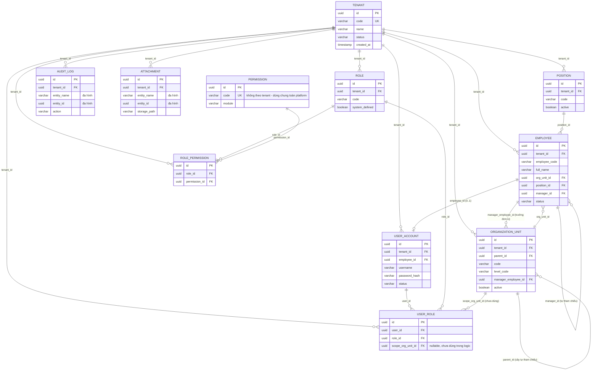

# Thiết kế Database

Tài liệu mô tả schema database GOVIA — lấy trực tiếp từ Postgres thật (`docker exec govia-postgres psql -U govia -d govia -c "\d <table>"`) và các file migration Liquibase trong `backend/govia-identity/src/main/resources/db/changelog/changes/`, không suy diễn.

## 1. Nguyên tắc thiết kế chung

- **Multi-tenant dùng chung schema**: mọi bảng nghiệp vụ có cột `tenant_id` (UUID, FK tới `tenant.id`) — cách ly dữ liệu giữa các tenant bằng điều kiện lọc ở tầng ứng dụng (xem [Kiến trúc kỹ thuật](../kien-truc-ky-thuat/README.md) mục 3), **không** cách ly bằng schema/database riêng.
- **Khoá chính**: mọi bảng dùng `id UUID` (sinh bởi Hibernate `@UuidGenerator`, không dùng `SERIAL`/`IDENTITY`).
- **Cột chuẩn kế thừa từ `BaseEntity`** (có ở mọi bảng trừ `permission`, xem mục 6): `tenant_id`, `created_at`, `created_by`, `updated_at`, `updated_by`, `row_version` (optimistic locking).
- **Unique theo tenant**: hầu hết ràng buộc duy nhất là **ghép cặp** `(tenant_id, code)` chứ không phải `code` một mình — 2 tenant khác nhau được phép dùng trùng mã.
- **Migration**: Liquibase, mỗi thay đổi là 1 file `NNN-*.yaml` đánh số thứ tự trong `changes/`, không sửa lại changeset đã áp dụng.

## 2. Sơ đồ quan hệ (ERD)

## 3. Chi tiết từng bảng

### 3.1. `tenant`

Không kế thừa `BaseEntity` đầy đủ — chỉ có `id`, `code`, `name`, `status`, `created_at` (không có `created_by`/`updated_at`/`updated_by`/`row_version`, vì đây là bảng gốc mà mọi audit khác quy chiếu tới, không tự tham chiếu chính nó).

| Cột | Kiểu | Ràng buộc |
|---|---|---|
| `id` | uuid | PK |
| `code` | varchar(50) | NOT NULL, **UNIQUE** (`uk_tenant_code`) |
| `name` | varchar(255) | NOT NULL |
| `status` | varchar(20) | NOT NULL, mặc định `'ACTIVE'` (enum `TenantStatus`: `ACTIVE`\|`SUSPENDED`) |
| `created_at` | timestamp | NOT NULL |

Được **9 bảng khác** tham chiếu tới qua `tenant_id` (mọi bảng nghiệp vụ + `audit_log` + `attachment`).

### 3.2. `employee`

| Cột | Kiểu | Ràng buộc |
|---|---|---|
| `id` | uuid | PK |
| `tenant_id` | uuid | NOT NULL, FK → `tenant.id` |
| `employee_code` | varchar(50) | NOT NULL |
| `full_name` | varchar(255) | NOT NULL |
| `email`, `personal_email` | varchar(255) | nullable — 2 cột tách biệt email công ty/cá nhân |
| `phone` | varchar(30) | nullable |
| `org_unit_id` | uuid | nullable, FK → `organization_unit.id` |
| `position_id` | uuid | nullable, FK → `position.id` |
| `hire_date`, `date_of_birth` | date | nullable |
| `status` | varchar(20) | NOT NULL, mặc định `'ACTIVE'` (enum `EmployeeStatus`: `ACTIVE`\|`ON_LEAVE`\|`TERMINATED`) |
| `gender` | varchar(10) | nullable (`MALE`\|`FEMALE`\|`OTHER`) |
| `id_number` | varchar(30) | nullable (số CMND/CCCD) |
| `manager_id` | uuid | nullable, FK → `employee.id` (**tự tham chiếu**, dựng cây quản lý báo cáo) |
| + 5 cột chuẩn `BaseEntity` | | |

**Ràng buộc duy nhất:** `(tenant_id, employee_code)` — `uk_employee_tenant_code`.
**Index:** `ix_employee_manager`, `ix_employee_org_unit`, `ix_employee_position` — phủ đúng 3 cột FK hay dùng để lọc/join (`EmployeeFilter`, xem tài liệu Nhân sự).
**Được tham chiếu bởi:** `employee.manager_id` (chính nó), `user_account.employee_id`.

### 3.3. `organization_unit`

| Cột | Kiểu | Ràng buộc |
|---|---|---|
| `id` | uuid | PK |
| `tenant_id` | uuid | NOT NULL, FK → `tenant.id` |
| `parent_id` | uuid | nullable, FK → `organization_unit.id` (**tự tham chiếu**, dựng cây tổ chức) |
| `code` | varchar(50) | NOT NULL |
| `name` | varchar(255) | NOT NULL |
| `type` | varchar(50) | nullable (nhãn tự do, vd `"COMPANY"` ở dữ liệu seed) |
| `level_code` | varchar(10) | nullable — quy ước ứng dụng: `001`=Khối, `002`=Trung tâm, `003`=Phòng ban, `004`=Bộ phận (**không có CHECK constraint ở DB**, validate hoàn toàn ở tầng service) |
| `manager_employee_id` | uuid | nullable, FK → `employee.id` |
| `active` | boolean | NOT NULL, mặc định `true` |
| + 5 cột chuẩn `BaseEntity` | | |

**Ràng buộc duy nhất:** `(tenant_id, code)` — `uk_org_unit_tenant_code`.
**Index:** `ix_org_unit_tenant`.
**Được tham chiếu bởi:** `organization_unit.parent_id` (chính nó), `employee.org_unit_id`, `user_role.scope_org_unit_id`.

### 3.4. `position`

Bảng master-data phẳng, đơn giản nhất trong toàn schema.

| Cột | Kiểu | Ràng buộc |
|---|---|---|
| `id` | uuid | PK |
| `tenant_id` | uuid | NOT NULL, FK → `tenant.id` |
| `code` | varchar(50) | NOT NULL |
| `name` | varchar(255) | NOT NULL |
| `active` | boolean | NOT NULL, mặc định `true` |
| + 5 cột chuẩn `BaseEntity` | | |

**Ràng buộc duy nhất:** `(tenant_id, code)` — `uk_position_tenant_code`.
**Được tham chiếu bởi:** `employee.position_id`.

> Lưu ý đặt tên: bảng tên `position` trùng từ khoá SQL nên trong log/DDL Postgres luôn thấy đặt trong ngoặc kép `"position"`.

### 3.5. `role`

| Cột | Kiểu | Ràng buộc |
|---|---|---|
| `id` | uuid | PK |
| `tenant_id` | uuid | NOT NULL, FK → `tenant.id` |
| `code` | varchar(100) | NOT NULL |
| `name` | varchar(255) | NOT NULL |
| `description` | varchar(500) | nullable |
| `system_defined` | boolean | NOT NULL, mặc định `false` — `true` = vai trò hệ thống (`SUPER_ADMIN`), khoá sửa/xoá ở tầng service |
| + 5 cột chuẩn `BaseEntity` | | |

**Ràng buộc duy nhất:** `(tenant_id, code)` — `uk_role_tenant_code`.
**Được tham chiếu bởi:** `role_permission.role_id`, `user_role.role_id`.

### 3.6. `permission`

**Bảng DUY NHẤT không có `tenant_id`** — danh mục quyền dùng chung cho TOÀN platform, không phân theo tenant (mọi tenant nhìn cùng 1 danh mục quyền có thể gán). Cũng không kế thừa đủ `BaseEntity` (không có audit fields/`row_version`) vì danh mục này gần như tĩnh, quản lý qua Liquibase (`006-permission-catalog.yaml`, `007-permission-resource-label.yaml`) chứ không qua CRUD người dùng.

| Cột | Kiểu | Ràng buộc |
|---|---|---|
| `id` | uuid | PK |
| `code` | varchar(150) | NOT NULL, **UNIQUE** (`uk_permission_code`) — dạng `MODULE.RESOURCE.ACTION`, vd `PEOPLE.EMPLOYEE.VIEW` |
| `module` | varchar(50) | NOT NULL — vd `PEOPLE`, `WORKFLOW` *(cũ, xem mục 7)* |
| `description` | varchar(500) | nullable |
| `resource_label` | varchar(150) | nullable — nhãn hiển thị tên màn hình trên UI ma trận phân quyền |

Có đúng 1 dòng đặc biệt `code = "*"` (seed bởi `DataSeeder`) — quyền wildcard nội bộ, không hiển thị trong danh mục UI (`RoleService.listPermissions()` lọc bỏ), đại diện "toàn quyền" cho `SUPER_ADMIN`.

**Được tham chiếu bởi:** `role_permission.permission_id`.

### 3.7. `role_permission` (bảng nối n-n)

| Cột | Kiểu | Ràng buộc |
|---|---|---|
| `id` | uuid | PK |
| `tenant_id` | uuid | NOT NULL, FK → `tenant.id` |
| `role_id` | uuid | NOT NULL, FK → `role.id` |
| `permission_id` | uuid | NOT NULL, FK → `permission.id` |
| + 5 cột chuẩn `BaseEntity` | | |

**Ràng buộc duy nhất:** `(role_id, permission_id)` — `uk_role_permission` (1 quyền chỉ gán 1 lần cho 1 vai trò, không trùng).

### 3.8. `user_role` (bảng nối n-n)

| Cột | Kiểu | Ràng buộc |
|---|---|---|
| `id` | uuid | PK |
| `tenant_id` | uuid | NOT NULL, FK → `tenant.id` |
| `user_id` | uuid | NOT NULL, FK → `user_account.id` |
| `role_id` | uuid | NOT NULL, FK → `role.id` |
| `scope_org_unit_id` | uuid | nullable, FK → `organization_unit.id` |
| + 5 cột chuẩn `BaseEntity` | | |

**Index:** `ix_user_role_user`.

> **`scope_org_unit_id` — cột đã có sẵn trong schema nhưng CHƯA được dùng trong logic ứng dụng.** Comment gốc trên entity `OrganizationUnit` mô tả ý định: *"lam scope cho ABAC (vd: quyen chi ap dung trong pham vi 1 org unit + cac unit con)"* — tức là dự trù cho phân quyền theo phạm vi đơn vị tổ chức (vd 1 vai trò "Trưởng phòng" chỉ có hiệu lực trong phòng ban của mình + các đơn vị con, không phải toàn tenant). Hiện tại `UserAccountService.assignRoles()` **không đọc/ghi** cột này — mọi vai trò đang có hiệu lực **toàn tenant**, không giới hạn phạm vi. Cần lưu ý khi mở rộng logic ABAC sau này: schema đã sẵn sàng, chỉ thiếu phần service.

### 3.9. `user_account`

| Cột | Kiểu | Ràng buộc |
|---|---|---|
| `id` | uuid | PK |
| `tenant_id` | uuid | NOT NULL, FK → `tenant.id` |
| `employee_id` | uuid | nullable, FK → `employee.id` (null = tài khoản hệ thống/tích hợp, không gắn nhân viên) |
| `username` | varchar(100) | NOT NULL |
| `password_hash` | varchar(255) | NOT NULL — luôn là BCrypt hash, không có cột lưu plaintext |
| `email` | varchar(255) | nullable |
| `status` | varchar(20) | NOT NULL, mặc định `'ACTIVE'` (enum `UserStatus`: `ACTIVE`\|`LOCKED`\|`DISABLED`) |
| `last_login_at` | timestamp | nullable |
| `mfa_enabled` | boolean | NOT NULL, mặc định `false` — **cột đã có sẵn nhưng chưa có luồng MFA nào trong code hiện tại** |
| + 5 cột chuẩn `BaseEntity` | | |

**Ràng buộc duy nhất:** `(tenant_id, username)` — `uk_user_account_tenant_username`.
**Được tham chiếu bởi:** `user_role.user_id`.

> Không có ràng buộc DB nào ép "1 Employee tối đa 1 UserAccount" (không có UNIQUE trên `employee_id`) — quy tắc này hiện chỉ được đảm bảo ở tầng service (`UserAccountService.createForEmployee`, kiểm tra `existsByEmployeeId` trước khi tạo), **không phải bất biến ở DB**.

### 3.10. `audit_log` (đa hình, dùng chung toàn platform)

| Cột | Kiểu | Ràng buộc |
|---|---|---|
| `id` | uuid | PK |
| `tenant_id` | uuid | NOT NULL, FK → `tenant.id` |
| `entity_name` | varchar(100) | NOT NULL — tên entity dạng chuỗi tự do (vd `"Employee"`, `"Role"`), **không phải FK thật** |
| `entity_id` | uuid | nullable — id của bản ghi liên quan, **không phải FK thật** (đa hình, có thể trỏ tới bất kỳ bảng nào) |
| `action` | varchar(20) | NOT NULL (enum `AuditAction`: `CREATE`\|`UPDATE`\|`DELETE`\|`LOGIN`\|`LOGOUT`\|`EXPORT`\|`APPROVE`\|`REJECT`) |
| `detail` | varchar(4000) | nullable — mô tả ngữ cảnh dạng câu, KHÔNG dùng CLOB (cố ý, xem comment trong `AuditLog.java`: tránh Hibernate schema-validation lệch giữa Postgres/H2/Oracle do CLOB trừu tượng mỗi DB sinh kiểu cột khác nhau) |
| `source_ip` | varchar(64) | nullable — có cột sẵn nhưng **hiện `AuditLogService.record()` không truyền giá trị này**, luôn null |
| + 5 cột chuẩn `BaseEntity` | | |

**Index:** `ix_audit_log_entity` (`entity_name`, `entity_id` — tra cứu lịch sử theo 1 bản ghi cụ thể), `ix_audit_log_tenant_created` (`tenant_id`, `created_at` — liệt kê theo thời gian trong 1 tenant).

Bản ghi audit **tồn tại độc lập** với entity gốc — xoá entity gốc không xoá kèm audit log (dùng làm bằng chứng lịch sử, xem ví dụ thực tế ở tài liệu Kiến trúc kỹ thuật/ghi chú workflow đã gỡ bỏ nhưng audit log liên quan vẫn còn).

### 3.11. `attachment` (đa hình, dùng chung toàn platform)

| Cột | Kiểu | Ràng buộc |
|---|---|---|
| `id` | uuid | PK |
| `tenant_id` | uuid | NOT NULL, FK → `tenant.id` |
| `entity_name`, `entity_id` | varchar(100) / uuid | đa hình, giống `audit_log` — không phải FK thật |
| `file_name` | varchar(255) | NOT NULL |
| `content_type` | varchar(150) | nullable |
| `size_bytes` | bigint | nullable |
| `storage_path` | varchar(500) | NOT NULL — đường dẫn lưu trên ổ đĩa (`LocalFileAttachmentServiceImpl`) |
| + 5 cột chuẩn `BaseEntity` | | |

**Index:** `ix_attachment_entity` (`entity_name`, `entity_id`).

## 4. Quy ước Liquibase changelog hiện có

| File | Nội dung |
|---|---|
| `001-core-schema.yaml` | Khởi tạo: `tenant`, `employee`, `organization_unit`, `position`, `role`, `permission`, `role_permission`, `user_role`, `user_account`, `audit_log`, `attachment` |
| `002-employee-org-extend.yaml` | Mở rộng Employee/OrgUnit (thêm các cột nghiệp vụ) |
| `003-employee-personal-email.yaml` | Thêm `employee.personal_email` |
| `004-audit-log-detail-varchar.yaml` | Đổi `audit_log.detail` sang VARCHAR tường minh (lý do nêu ở mục 3.10) |
| `005-position.yaml` | Tạo bảng `position` |
| `006-permission-catalog.yaml` | Nạp danh mục quyền ban đầu vào bảng `permission` |
| `007-permission-resource-label.yaml` | Thêm cột `permission.resource_label` |

> 3 changelog liên quan tới module Workflow (`008-workflow-schema.yaml`, `009-workflow-trigger-rules.yaml`, `010-workflow-subprocess.yaml`) đã bị **xoá hoàn toàn** cùng với việc gỡ bỏ module Workflow khỏi hệ thống — không còn trong danh sách include của `db.changelog-master.yaml`, các bảng `workflow_*`/`approval_chain*` cũng đã bị DROP khỏi Postgres thật. Xem tài liệu Nhân sự, mục 7.

## 5. Danh sách bảng hiện có (tổng hợp)

| Bảng | Vai trò |
|---|---|
| `tenant` | Gốc multi-tenant |
| `employee` | Nhân sự |
| `organization_unit` | Cây tổ chức |
| `position` | Chức danh |
| `role` | Vai trò RBAC |
| `permission` | Danh mục quyền (dùng chung toàn platform, không theo tenant) |
| `role_permission` | Nối Role ↔ Permission |
| `user_role` | Nối UserAccount ↔ Role |
| `user_account` | Tài khoản đăng nhập |
| `audit_log` | Nhật ký thao tác (đa hình) |
| `attachment` | File đính kèm (đa hình) |

`databasechangelog`/`databasechangeloglock` là 2 bảng nội bộ do Liquibase tự quản lý, không thuộc mô hình dữ liệu nghiệp vụ.
